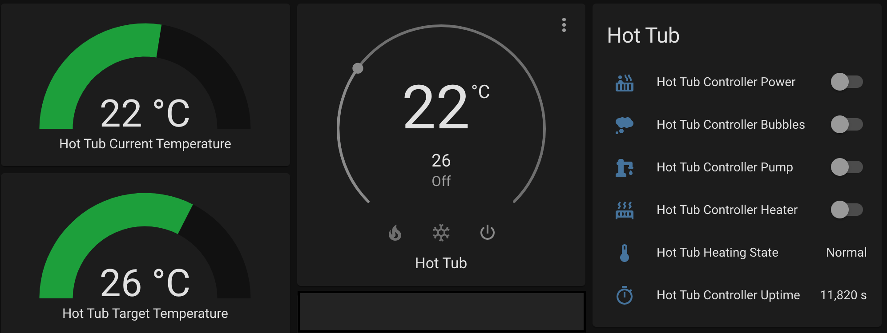

# MaiPureSpaController 

## IoT Controller for Intex PureSPAtm
This solution will allow you to control your Intex PureSpatm SSP-H_20-1C from your iPhone/iPad/Watch using a Web Interface & MQTT (with optional Home Assistance integration). 

## History
  Entirely based on the work of [@UlrichMai](https://github.com/UlrichMai/MaiPureSpaController). The hardware design was great, and was just what I was looking for (no big relay switches needed). The code was a great starting point, with all the SPI codes already decoded. Using this I set about removing the HomeKit support, as I inented to intergate it with [Home Assistant](https://www.home-assistant.io). 

  MQTT is the best and easiest way to integrate custom ESP builds, so thats what I did. 

  I've spent quie a bit of time testing and stablising the code, so that I can confidently leave it running and not get any restarts. 

## Hardware
### Schematic
 
D5, D6, D7 are connected in parallel to the serial signals flowing to the display from the main pool controller. These will be decoded to read the LED status, the displayed temperatures and simulate the button press at the right time.

D0 is used to simulate the button press by dragging the data line D5 low. R1 has the same value as the corresponding R25 on the display PCB.

R2 with the connection to buzzer circuitry is used to shut off the buzzer (I hate that beep) and control it thru D2 for signaling purpose during startup. The resistor value resulted from tries, not calculation. If you think this might harm the ESP, and another value is working better for you, let me know.

The Schottky diode allows 5V power to flow only in direction to the ESP. Otherwise your ESP USB port will power complete pool main unit, when you connect a cable for serial debugging or flashing.

As you can see, I don't use any logic level converters. Not using them makes the hardware setup much simpler and there other solution out there that work well without converters. 

### Components
You need these components:
- ESP8266 with 4Mbit in mini format, eg. D1 Mini
- Resistors 1kOhm, 100Ohm
- Schottky diode 1N5819
- double sided tape to fix the ESP on the back of the panel
- some wires and heat shrink tubing

### Wiring
Please see the wiring on the following pictures:

 

 

 

 

 

 

## Firmware
### Signal analysis
The signal sent from the main unit to the display looks like this:

While the select signal (1) is low, 16 bits are sent with each clock pulse (2). The data signal (3) is read on the rising edge of clock pulse. The most significant bit is sent first. This kind of transmission is very similar to an SPI mode 3 interface [Serial Peripheral Interface](https://en.wikipedia.org/wiki/Serial_Peripheral_Interface).

This table shows the meaning of the bits:

Each 16bit transmission either 
- displays a number on one of the 4 digits, 
- lights a combination of the LEDs,
- queries one of the buttons,
- or generates a beep.

All display elements are addressed in each cycle. The duration of one cycle is 20ms, meaning it repeats with a frequency of 50Hz. This is fast enough, that you don't see the display or LED flicker.
With the above information we can decode the data stream and read the temperature and see if power, pump or heater are on.

### The button press problem
To really remote control the pool, we need to simulate pressing the buttons. This will enable us to switch the pool on, select a heating temperature and start heating the pool.
Several project out here are struggling with the problem to solve this with software. This project [YorffoeG/diyscip](https://github.com/YorffoeG/diyscip) uses extra hardware to solve that problem.

To simulate a button press, we need to pull the data line low for the next 16bit transmission after we received the code for one of the button queries. I use an extra digital output pin (D0) connected to the data input pin (D5) with a 1kOhm resistor. This is exactly what the pool display hardware does.

Example: If we want to simulate a power button press, we need to wait for the data 0xFBFF (ignoring the buzzer bit) and then set D0 to low. We need to repeat this 10 times to be recognized as a valid button press.

**Timing is very critical!** When the select signal goes high, ending a 16 bit cycle, we need to pull down the data signal as fast as possible. My current solution needs 5µs, and this works:

I added some code once for debugging purpose that adds another 0.8µs to that delay and button press was not recognized anymore. To be that fast you need to select 160MHz CPU frequency, but this is needed for the HomeKit library anyway.

### Building the firmware
I used Arduino IDE 1.8.12 with the following board settings:

You need to install the following libraries:
- HomeKit-ESP8266 by Mixiaoxiao Version 1.2.0
- ArduinoQueue by Einar Arnason Version 1.2.3

The ESP8266WiFi, ESP8266WebServer and ArduinoOTA libraries should be there by default.

You need to edit the Private.h file and add your wifi SSID and password and choose an password for OTA updates.

Then try to build it and download it to you module.

### Web UI
The firmware offers an web interface, that you can check in first place, before trying to connect to HomeKit. It is not really needed, except for resetting the HomeKit connection. It is a relict from the time before I added the HomeKit integration.

### Home Assistant Integration

## Buzzer Beeps
One of the wires I connected to the display controller board gave me control over the buzzer. First and main idea was to shut off the annoying beeps. But I also use it for signaling. You will hear 3 beeps during startup:
1. the setup routine starts
2. Wifi has successfully connected
3. HomeKit connection established

## Known problems
- After a reboot, it has lost the target temperature. I planned to persist the value, to restore it after a reboot.
- You need to switch the power on before heater or pump control will have any effect on the unit. There is room for improvement in the future.

## Alternative solution, future developments
- I have looked into ESP-32 and the SPI slave mode and got it to work. But even with the built-in SPI interface of the ESP-32, the delay until the ISR is called was inconsistent and often too long and it misses some data.
- I am planning contribute to [YorffoeG/diyscip](https://github.com/YorffoeG/diyscip) project. The code is much cleaner and well structured, with a nice configuration interface.

## Tools
### [AZDelivery Logic Analyzer](https://www.amazon.de/dp/B01MUFRHQ2/ref=cm_sw_em_r_mt_dp_U_rV88EbT2E5JSH)
This a very cheap tool that helps a lot analyzing the SPI signals. I also used it to debug inside the time critical interrupt routines, by setting extra digital out pins high/low.

